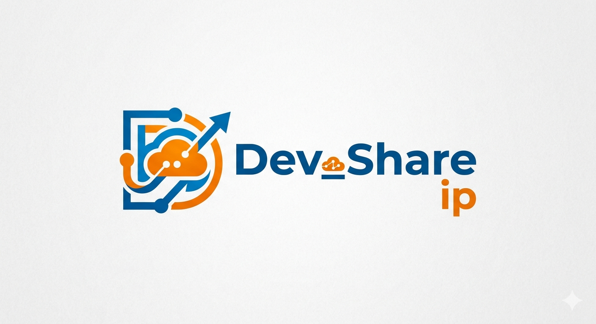

<p align="center">
  
</p>
<h1 align="center">devshareIP</h1>
<p align="center">
  A zero-config local development server with <strong>live reload</strong>, <strong>public tunneling</strong>, and <strong>QR<br>
  code sharing</strong> — all in one command.
</p>
<p align="center">
  
  
  
  
  
  
  
</p>

---

## Install

```bash
npm install
```

---

## Usage

```bash
# Basic local server (port 3000, current directory)
npm run dev

# Share publicly + show QR code in terminal
npm run dev -- --share --qrcode

# Custom port and directory
npm run dev -- -p 8080 -d ./dist

# All options
npm run dev -- --share --qrcode --port 8080 --dir ./dist --open
```

---

## Options

| Flag | Alias | Default | Description |
|------|-------|---------|-------------|
| `--port` | `-p` | `3000` | Port to serve on |
| `--dir` | `-d` | `.` | Directory to serve |
| `--share` | `-s` | `false` | Create a public tunnel URL |
| `--qrcode` | `-q` | `false` | Display QR code in terminal |
| `--open` | `-o` | `false` | Open browser on start |
| `--watch` | `-w` | `true` | Watch for file changes |
| `--no-watch` | | | Disable live reload |

---

## Features

- ⚡ **Live Reload** — WebSocket-based hot reload injected into every HTML page
- 🌐 **Public Sharing** — One flag (`--share`) exposes your server via [localtunnel](https://github.com/localtunnel/localtunnel)
- 📱 **QR Code** — Terminal QR code for instant mobile testing
- 📂 **Auto Directory Listing** — Browse folders with a slick dark UI
- 🎨 **Beautiful CLI** — Figlet banner, colored status, clean output

---

## Global Install

```bash
npm install -g .
devshare --share --qrcode
```
